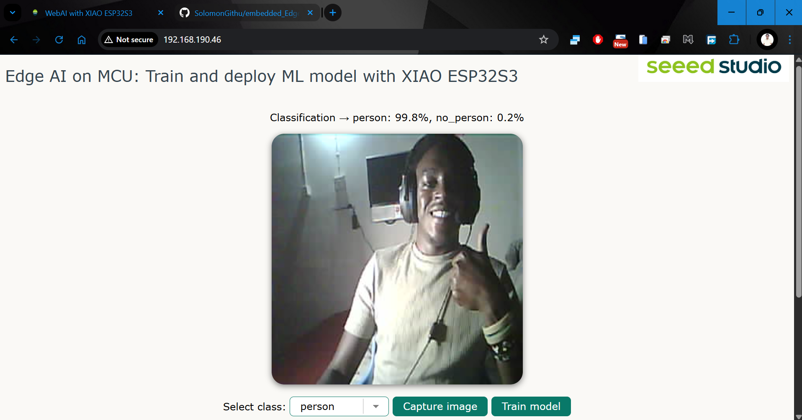

# Embedding both ML training and inference on MCU - XIAO ESP32S3 Sense


The complete project documentation is available on Hackster.io: [Embedding ML training on MCU](https://www.hackster.io/sologithu/embedding-ml-training-on-mcu-b3cfd2).

There has been impressive advancements in both hardware and software enabling us to achieve advanced computation on the smallest low-power computers. However, we cannot implement complex data processing and train efficient models on MCUs since they are very constrained especially on flash and RAM. Simple algorithms cannot process data efficiently leading to very poor training. 

This project implements training and deploying ML models through Web AI technology by embedding the training and inference instructions on a microcontroller such as the XIAO ESP32S3 Sense. The board runs as a web server and it sends both the camera feed and a web application to a client(a browser) via HTTP. The client is then able to capture images with the XIAO ESP32S3 and train a simple image classification model using [TensorFlow.js](https://www.tensorflow.org/js), all locally in the browser! Afterwards, the model will be automatically saved to a SD card and the XIAO ESP32S3 Sense will in addition start serving the local model to a client and inference will also start. 

The tiny [XIAO ESP32S3 Sense](https://wiki.seeedstudio.com/xiao_esp32s3_getting_started/) was a perfect choice for this project since it integrates an on-board camera sensor, SD card, 8MB PSRAM and 8MB Flash. At the core of this board is the ESP32S3: Xtensa LX7 dual-core, 32-bit processor that operates at up to 240 MHz while also supporting 2.4GHz Wi-Fi subsystem. This formed the end Edge AI goal of the project:
- Run a web server on the XIAO ESP32S3: The web server's task is to serve both camera feed and web files for training an image classification model and running inference as well; through a web browser.
- Save a trained model on the SD card interface of the XIAO ESP32S3.
- Load a model from the SD card interface of the XIAO ESP32S3, and allow retraining.
- Develop this project with a friendly codebase that will allow seamless advancements and customization.

Note that the project can also be run on other ESP32 boards but the camera and SD card configurations will need to be updated. To change the camera model, select the correct one in the code [XIAO_ESP32S3_Edge_AI.ino](XIAO_ESP32S3_Edge_AI/XIAO_ESP32S3_Edge_AI.ino). Identify the pin details of your board's SD card interface and in the Arduino sketch set the correct GPIO number for chip select pin in ```SD.begin()``` e.g ```SD.begin(21)``` if the chip select is connected to GPIO 21.

Below is a video demonstrating how to setup and train models.

[](http://www.youtube.com/watch?v=UVWmFLhP9X4 "Embedding ML training on MCU")

## Quick Start

- On your PC, ensure that you have installed Arduino IDE, [ESPAsyncWebServer library](https://github.com/ESP32Async/ESPAsyncWebServer), and the esp32 board.
- Open the Arduino sketch [XIAO_ESP32S3_Edge_AI.ino](XIAO_ESP32S3_Edge_AI/XIAO_ESP32S3_Edge_AI.ino) and replace both ```wifi_SSID``` and ```wifi_password``` values with the Wi-Fi network name and password that you want the XIAO board to connect to. You can also define the Access Point (Wi-Fi hotspot) credentials with the variables ```ap_SSID``` and ```ap_password```.
- If you intend to upload the sketch to a XIAO ESP32S3 (default), ensure that ```CAMERA_MODEL_XIAO_ESP32S3``` is defined (not commented).
- On the Arduino IDE 'Tools' setting, ensure 'PSRAM' is set to 'OPI PSRAM'. Also select the correct board, 'XIAO_ESP32S3' for this project.
- Connect the XIAO ESP32S3 Sense to your PC and upload the sketch. **Ensure that a 2.4 GHz antenna is connected to the board** and open a serial interface such as the [Serial monitor](https://docs.arduino.cc/software/ide-v2/tutorials/ide-v2-serial-monitor/) (set the baud rate to 115200). Next, copy the IP address that the board has been assigned. Disconnect the board from your PC after copying the IP address.


- Open the [index.html](web_ai/index.html) file and paste the IP address of the board to the ```esp32S3_ip_address``` variable.
- Copy the folder [web_ai](web_ai/) to an SD card that has been [formatted to FAT32 file system](https://wiki.seeedstudio.com/xiao_esp32s3_sense_filesystem/#prepare-the-microsd-card). Once the folder has been copied, place the SD card in the XIAO ESP32S3 Sense SD card slot.

> **Note:** With the XIAO ESP32S3 Sense, you cannot use the SPI functions when utilizing the SD card interface. In this case, you need to connect/solder together the J3 pads on the expansion board for the SD card interface to work. This is illustrated in the image below <em>(source: https://wiki.seeedstudio.com/xiao_esp32s3_sense_filesystem/#card-slot-circuit-design-for-expansion-boards)</em>.


## Train and run models

Once the XIAO ESP32S3 Sense (or other ESP board) has been programmed, SD card inserted and powered, it will connect to the set Wi-Fi network or create an Access Point. If the board is on AP mode, connect to the hotspot. Afterwards, use a PC or a mobile phone to access the Web UI through a browser by entering the IP Address of the board in the URL section. The web UI (completely served by the XIAO ESP32S3) shows live camera feed, buttons to capture images for the selected class and buttons to train an image classification model. The training and inference logs are also shown on the UI.


> **Note:** You can easily update the class labels using the ```class_labels``` variable in the [index.html](web_ai/index.html) file. Ensure the size of the ```class_labels``` array matches with ```image_counts_per_class```! You can add more classes as well.

Place an object in front of the camera and capture images of the respective class. Do the same process for other classes which can be set by using the dropdown. 


Once you have captured a considerable number of images, click 'Train model'. A simple image classification model will be trained and saved on the SD card (note that saving the ```model.json``` and ```model.weights.bin``` files will take sometime but the serial logs will show the file saving progress).


If ```model.json``` and ```model.weights.bin``` files exist on the root of the SD card, the model will be loaded automatically and inference will start on the browser when a client accesses the Web UI. If no model is found on the SD card, the user needs to capture images for each class and train a model.




You can also access the user interface using a mobile browser. In my tests, I trained upto 50 images on both PC and mobile browsers and the training was successful.


## Development and test environments

Below are the development environments that I had when working on this project. This is simply to keep note of incase software updates lead to incompatibilities.

1) Arduino IDE: 
- Version: 1.8.15
- ESP32 board for Arduino IDE: contributor = Espressif Systems, version = 2.0.17
- ESPAsyncWebServer library: contributor = ESP32Async, version = 3.7.7
2) VS Code
3) Web browsers: Google Chrome, Microsoft Edge, Opera(Android)